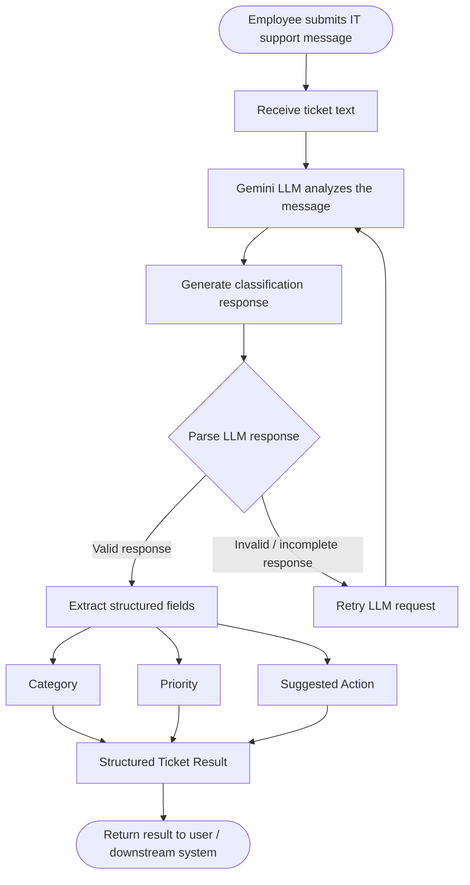
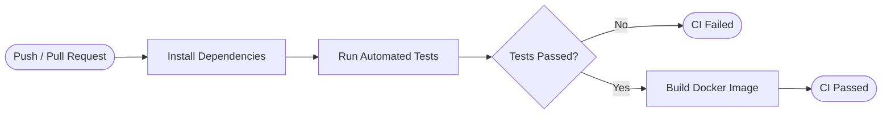

# IT Support Ticket Classifier Agent

An LLM-powered agent that reads an employee's IT support request and turns it into a structured ticket classification.

The agent uses **Google Gemini** to determine the ticket's **category**, **priority**, and a **suggested action**. The project also includes automated tests, Docker support, and a GitHub Actions CI pipeline.

---

## What the Agent Does

An employee can provide a normal IT support message such as:

> "My laptop is connected to Wi-Fi but the internet is not working."

The agent analyzes the message and returns:

```text
Category: Network
Priority: High
Suggested Action: Check DNS and network connectivity
```

The structured output can then be used by an IT helpdesk or ticketing system for further processing.

---

## Classification

### Category

Every ticket is classified into one of the following categories:

* **Network**
* **Access**
* **Software**
* **Hardware**
* **Other**

### Priority

The agent assigns one of four priority levels:

* **Low**
* **Medium**
* **High**
* **Critical**

### Suggested Action

The agent also provides a short, practical next step based on the issue.

For example:

```text
Category: Access
Priority: High
Suggested Action: Verify the user's account status and reset credentials if required
```

---

# Workflow

The complete agent flow is:



### In simple terms

```text
Employee Message
       ↓
Gemini analyzes the issue
       ↓
Generates classification
       ↓
Response is parsed
       ↓
Is the response valid?
    ↙           ↘
  No             Yes
  ↓               ↓
Retry          Extract fields
  ↓            ↙    ↓     ↘
Gemini      Category Priority Suggested Action
                  \     |      /
                   \    |     /
                    ↓   ↓    ↓
                Structured Result
                       ↓
                  Final Ticket
```

The important part of the workflow is that the **LLM does the understanding**, while the application is responsible for **parsing the response and producing a consistent structured result**.

---

## Key Features

### LLM-Based Classification

Google Gemini is used to understand the employee's message and classify the issue.

The model is configured using:

```env
GEMINI_MODEL=gemini-3.6-flash
```

The model name can be changed through the environment configuration.

### Structured Output

Instead of returning only free-form text, the agent extracts:

```text
Category
Priority
Suggested Action
```

This makes the result easier for other applications or ticketing systems to consume.

### Retry Handling

The agent includes retry handling for failed or invalid LLM responses.

If the response cannot be parsed correctly, the application can retry the request instead of immediately failing.

### Automated Tests

The project contains a mocked test setup so tests can run **without making real Gemini API calls**.

The test suite covers normal cases as well as edge cases, retry behavior, and performance-related scenarios.

### Docker Support

The application can be packaged and run inside a Docker container using the included `Dockerfile`.

### GitHub Actions CI

A GitHub Actions workflow automatically runs the test suite and builds the Docker image whenever changes are pushed or a pull request is opened.

---

## Project Structure

```text
.
├── agent.py                    # Agent, Gemini client, prompt, parser and CLI
├── requirements.txt            # Runtime dependencies
├── requirements-dev.txt        # Runtime + testing dependencies
├── .env.example                # Environment variable template
├── Dockerfile                  # Docker image configuration
├── .dockerignore               # Files excluded from Docker build context
│
├── tests/
│   ├── __init__.py
│   ├── conftest.py             # FakeLLMClient fixture
│   └── test_agent.py           # Automated test suite
│
└── .github/
    └── workflows/
        └── ci.yml              # Test and Docker build pipeline
```

---

## File Overview

### `agent.py`

This is the main application file.

It contains:

* Gemini client wrapper
* LLM prompt
* Classification logic
* Response parser
* Retry handling
* CLI interface

### `tests/conftest.py`

Provides a `FakeLLMClient` so the tests can simulate LLM responses without calling the real Gemini API.

### `tests/test_agent.py`

Contains the automated tests for the agent, including normal classification, edge cases, retries, and performance-related checks.

### `Dockerfile`

Defines how the application is packaged into a Docker image.

### `.github/workflows/ci.yml`

Defines the CI pipeline that runs tests and builds the Docker image on pushes and pull requests.

---

## Example

### Input

```text
My laptop is connected to Wi-Fi but the internet is not working.
```

### Agent Output

```text
Category: Network
Priority: High
Suggested Action: Check DNS and network connectivity
```

---

## Another Example

### Input

```text
I cannot log in to my company account and I have an important meeting in 20 minutes.
```

### Agent Output

```text
Category: Access
Priority: Critical
Suggested Action: Verify account status and restore access immediately
```

The exact classification and suggested action are generated by the configured Gemini model.

---

## Testing

Development dependencies can be installed using:

```bash
pip install -r requirements-dev.txt
```

Run the test suite with:

```bash
pytest
```

The tests use a mocked LLM client, so running the test suite does not require a live Gemini API call.

The project currently includes **28 tests** covering:

* Normal classification
* Edge cases
* Invalid responses
* Retry behavior
* Performance-related scenarios

---

## Environment Setup

Create a `.env` file from the provided example:

```bash
copy .env.example .env
```

Then add your Gemini API key:

```env
GEMINI_API_KEY=your_api_key_here
GEMINI_MODEL=gemini-3.6-flash
```

The `.env` file should not be committed to GitHub because it contains the API key.

---

## Running Locally

Install the runtime dependencies:

```bash
pip install -r requirements.txt
```

Configure the `.env` file and then run the agent using the CLI provided in `agent.py`.

---

## Docker

Build the Docker image:

```bash
docker build -t it-support-ticket-classifier .
```

Run the container:

```bash
docker run --env-file .env it-support-ticket-classifier
```

This allows the same application to run in a containerized environment rather than relying only on the local Python environment.

---

## CI Pipeline

The project uses **GitHub Actions** for continuous integration.

The workflow is triggered on:

* Pushes to the repository
* Pull requests

The pipeline follows this process:



This helps ensure that new changes pass the automated tests and that the application can still be packaged successfully.

---

## Technologies Used

| Technology     | Purpose                         |
| -------------- | ------------------------------- |
| Python         | Application logic               |
| Google Gemini  | LLM-based ticket classification |
| pytest         | Automated testing               |
| Docker         | Containerization                |
| GitHub Actions | Continuous Integration          |
| dotenv         | Environment configuration       |

---

## Key Concepts Demonstrated

This project demonstrates how an LLM can be integrated into a structured software application rather than being used only for simple text generation.

**LLM integration** — Using Gemini to understand and classify unstructured IT support messages.

**Prompting** — Designing instructions that guide the model toward the required classification output.

**Response parsing** — Converting the model's response into structured information.

**Retry handling** — Handling failed or invalid model responses.

**Mocking** — Testing LLM-dependent code without making real API calls.

**Automated testing** — Verifying normal and edge-case behavior.

**Containerization** — Packaging the application with Docker.

**CI/CD fundamentals** — Automatically testing and building the project through GitHub Actions.

---

## Summary

This project demonstrates a complete small-scale LLM application workflow:

```text
Employee IT Support Message
            ↓
        Gemini LLM
            ↓
      Ticket Analysis
            ↓
   Response Validation
            ↓
 ┌──────────┼───────────┐
 ↓          ↓           ↓
Category  Priority  Suggested Action
 └──────────┼───────────┘
            ↓
     Structured Ticket
            ↓
      Downstream System
```

The main purpose of the project is to show how an LLM can be combined with **structured parsing, retry handling, automated testing, containerization, and CI** to create a more reliable and maintainable AI application.
